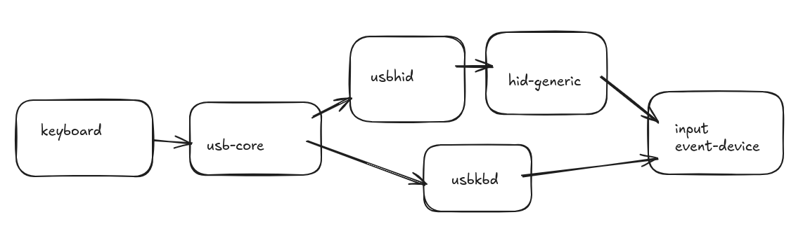

<div align="center">
  <h1>Linux Kernel Module for USB Keyboard</h1>
  <p><h3 align="center">USB HID Boot Protocol keyboard Module to Flash Leds on Keypress 🚀</h3></p>
</div>

<hr>





# 🛠️ Development

## Tested on Ubuntu 24.04 - 6.11.0-26-generic

## Make

```bash
make
```

# 🚀 Usage

## Replace Module

```bash
sh replace_usbkbd.sh
```

## Create Startup service

```bash
sudo chmod 777 create_service.sh replace_usbkbd.sh
./create_service.sh
```

## Test on QEMU VM

[Build](BUILD.md)


# 📝 Documentation

# 📚 References
[Original usbkbd.c](https://github.com/torvalds/linux/blob/master/drivers/hid/usbhid/usbkbd.c)

# 🤝🏻 Connect with Me

[](https://github.com/HuzaifaIrfan/)
[](https://www.huzaifairfan.com)

# 📜 License

Licensed under the GPL3 License, Copyright 2025 Huzaifa Irfan. [LICENSE](LICENSE)
